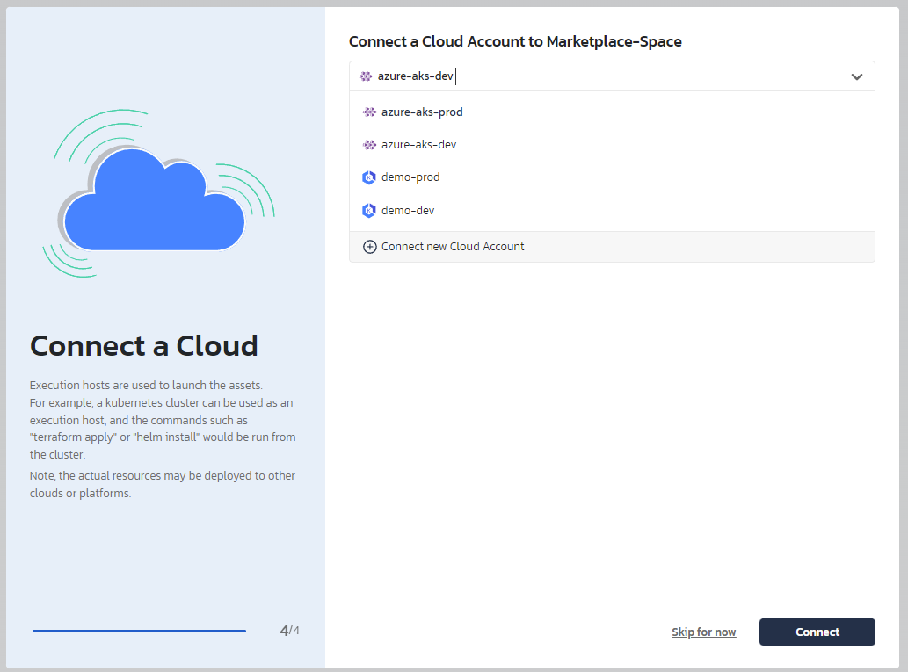

# Torque Building-blocks Marketplace

Welcome to Torque's marketplace - The place to find, learn more and share IaC modules, container orchestration assets and Torque bluerpints for easy onboarding to Torque or adding .

### Already have a Torque account? Jump to step X

## Step 1: Open Torque Portal
* On [Quali Torque page](https://www.qtorque.io/), click the __GET STARTED__ button.

## Step 2: Register to Torque
* You can register to Torque using email, GitHub or Gitlab accounts. Already have an account? Just sign in.

## Step 3: Create a new space and onboard the marketplace repository as an asset repository
1. Navigate to __Administration > Spaces__.
2. Click __Create Space__. Creating a new space includes providing a space name, selecting the space logo and color. 
3. Click __Create__.

4. As this repository is hosted in GitHub, select the GitHub logo, provide https://github.com/QualiTorque/Torque-Blueprint-Marketplace as the repository URL and click __Connect__. GitHub authentication is done in the background. In case of issues, take a look at our documentation page on GitHub authentication and follow the steps [here](https://docs.qtorque.io/admin-guide/source-control-github). 
5. Click __Discover Assets__.
  
 Torque's Asset Discovery process goes through the repository's sources and finds all known and supported IaC assets and container orchestration code, and show them in the discovery form.
6. You can now select assets and generate bluerpints out of them quickly and easly.
  
7. Select the cloud that will be associated to the space from the existing list of clouds configured in your Torque account. if you don't have a cloud configured yet, follow Torque's Docs for more information [here](https://docs.qtorque.io/getting-started/Connect%20a%20Kubernetes%20Cluster).
  

## Step 4: Add a blueprint repository
1. Navigate to the newly created space's __Settings > Repositories__. You can now see the marketplace repositiory configured as an asset repository. Next, add the repository as a bluerpint repository to enjoy existing blueprints that use multiple buliding blocks and custom orchestration.
2. Click __Add a Repository__ under the __Blueprint Repos__ section. 
3. Select GitHub and paste the https://github.com/QualiTorque/Torque-Blueprint-Marketplace repository.
4. Click __Connect__.

## Step 5: Give it a try!
1. Navigate to the space's __Bluerpints__ catalog to see all the bluerpints that were imported from the bluerpint repository.
2. Publish the bluerint you would like to use, and launch it.
   
